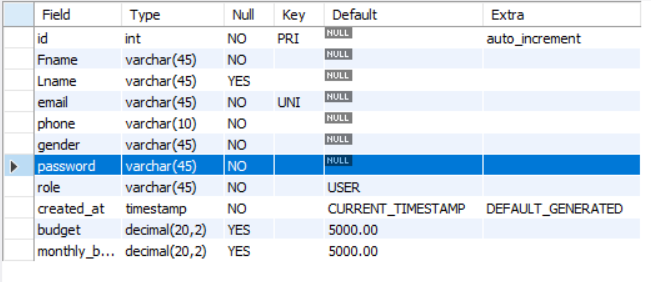
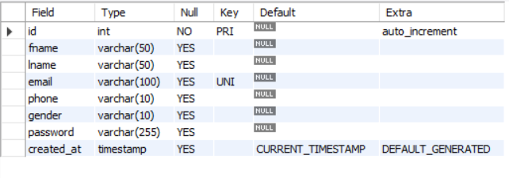
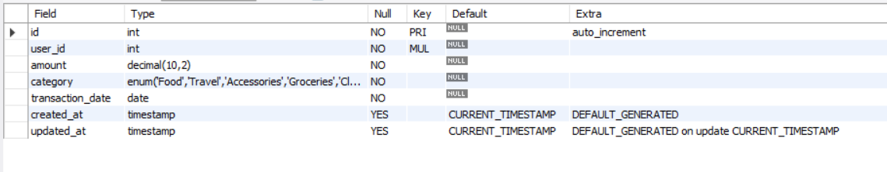

Copy the project folder inside: C:/xampp/htdocs/ - if not already added
Open the xampp: Start Apache and MySQL

Paste the below link in the browser:
http://localhost/ExpenseTracker/

✅ 1. Enable Event Scheduler (one-time setup)
In MySQL Workbench, run this:

SET GLOBAL event_scheduler = ON;
To make it persist after restart, add this in my.cnf (MySQL config file):

In your MySQL configuration file (my.cnf or my.ini), depending on your operating system.

🪟 For Windows:
Find your my.ini file.
It’s usually located in:

C:\ProgramData\MySQL\MySQL Server 8.0\my.ini

C:\Program Files\MySQL\MySQL Server 8.0\my.ini
Open the file with a text editor as Administrator.

Under the [mysqld] section, add this line:

[mysqld]
event_scheduler=ON
Save the file.

Restart MySQL server (via Services, or with XAMPP/WAMP if you're using that).

In workbench:
DELIMITER $$

CREATE EVENT IF NOT EXISTS update_monthly_budget
ON SCHEDULE
    EVERY 1 MONTH
    STARTS (TIMESTAMP(CURRENT_DATE + INTERVAL 1 - DAY(CURRENT_DATE) DAY))
DO
BEGIN
    UPDATE users 
    SET budget = monthlyBudget;
END$$

DELIMITER ;

✔ This will:

Run every month starting from the 1st of the next month at 00:00:00

Update each user’s budget by adding their monthlyBudget

To make the MySQL Event Scheduler run automatically after every MySQL restart, you need to set this line:

ini

CREATE TABLE admins (
    id INT AUTO_INCREMENT PRIMARY KEY,
    fname VARCHAR(50),
    lname VARCHAR(50),
    email VARCHAR(100) UNIQUE,
    phone VARCHAR(10),
    gender VARCHAR(10),
    password VARCHAR(255),
    created_at TIMESTAMP DEFAULT CURRENT_TIMESTAMP
);

